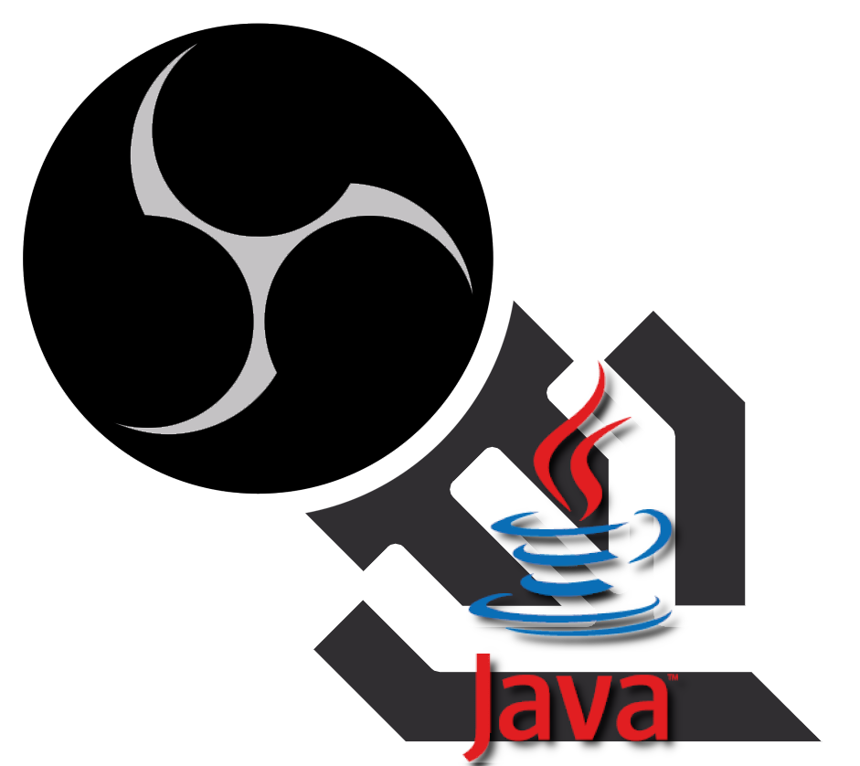

# OBS WebSocket Java

<p align="center">
  
  <br/>
  A Java library for the <a href="https://github.com/obsproject/obs-websocket">OBS-Studio WebSocket plugin</a> initiated by <a href="https://github.com/Palakis">Palakis</a>.
</p>

## Software Requirements

- OBS version 27+
- OBS Websocket version 5+

> Note: Streamlabs OBS (SLOBS) is not supported

## Dependencies

Include the library in your project from [Maven Central](https://mvnrepository.com/artifact/io.obs-websocket.community/client):

### Maven
```xml
<dependency>
  <groupId>io.obs-websocket.community</groupId>
  <artifactId>client</artifactId>
  <version>2.0.0</version>
</dependency>
```

### Gradle
```groovy
dependencies {
    implementation 'io.obs-websocket.community:client:2.0.0'
}
```

## Basic Usage & Examples
The _OBSRemoteController_ is the client entrypoint, providing methods to interact with OBS. Construct an (immutable) instance via the _builder_ and then connect.

```java
OBSRemoteController controller = OBSRemoteController.builder()
  // set options, register for events, etc.
  // continue reading for more information
  .build();
controller.connect();
```

Take a look at the [**example
project**](example/src/main/java/io/obswebsocket/community/client/example/Example.java) for a full
example.

A description of every request and event can be found in the plugin's
[**protocol.md**](https://github.com/obsproject/obs-websocket/blob/master/docs/generated/protocol.md)
file.

### Authentication / OBS Details

By default, the builder connects to `localhost` on port `4455` without a password, and will wait 3 seconds for an initial response from OBS.

> Version 5+ of OBS Websockets requires a password by default, so we recommend setting a password.

```java
OBSRemoteController controller = OBSRemoteController.builder()
  .host("localhost")                  // Default host
  .port(4455)                         // Default port
  .password("your secure password")   // Provide your password here
  .connectionTimeout(3)               // Seconds the client will wait for OBS to respond
  .build();
```

### OBS Event Registration
Listeners for OBS events can also be registered on the builder by specifying the event class and a callback that accepts the event.

```java
OBSRemoteController controller = OBSRemoteController.builder()
  // with a method reference; better practice.
  .registerEventListener(
    StudioModeStateChangedEvent.class, someInstance::someMethod
  )
  // with an anonymous lambda; useful for exploring/debugging.
  .registerEventListener(
    CurrentProfileChangedEvent.class, (event) -> System.out.println(event)
  )
  // ...     
.build();
```

### Connecting and Client Lifecycle Events
Connecting is non-blocking and by default the client will not connect until you call `connect()`. 

There are many lifecycle-related events available, however we recommend registering at least the `onReady` callback, as this is invoked once the client is ready to accept requests.

```java
// Build the controller
OBSRemoteController controller = OBSRemoteController.builder()
  // ...
  .lifecycle()
    .onReady(someClassInstance::yourMethodMakingRequests)
    .and()
  .autoConnect(false) // Default; do not connect when built
  // ...     
.build();

// Connect to OBS
controller.connect();
```

We do **not** recommend interacting with the controller outside the `onReady` callback; the main thread will likely complete before the client is ready to accept requests, and this will throw an error.
```java
// Build the controller
OBSRemoteController controller = OBSRemoteController.builder()
  // ...     
.build();

// Connect to OBS
controller.connect();

// Do NOT do this!
// This will cause an ERROR and shut-down the client
controller.getVersion(version -> System.out.println(version));
```

If you want to block main until the controller is ready, you can use a CompletableFuture; however, this is a poor practice so we do not show it here.

### Error Handling
When the OBS Websocket encounters a significant problem (failed authentication, unknown message type, etc) it will close the connection. These events can be observed in the  `onClose` lifecycle event. 

Individual requests will include a status code(SourceNotFound, HotkeyNotFound, etc) as part of the response and do not result in the connection being closed.

The `onError` communicator and controller lifecycle events are reserved for exceptional events (null pointers and other exceptions) and for failure to connect to OBS (for example, if OBS Websocket isn't installed, if OBS isn't running, or it isn't accessible over the network).

## Logging
This project ships with SLF4J as the logging facade, and uses SLF4J-Simple as the logging implementation
by default (logs are printed directly to the console).

As with any project using SLF4J, you are free to use a different SLF4J logger implementation. There
are many examples of how to do this online; for your convenience we demonstrate below how to 
configure Maven to use Logback instead:
```xml
<dependencies>
    <dependency>
       <groupId>io.obs-websocket.community</groupId>
        <artifactId>client</artifactId>
        <version>...</version>
      </dependency>
        <!-- Exclude the default logging implementation -->
        <exclusions>
            <exclusion>
                <groupId>org.slf4j</groupId>
                <artifactId>slf4j-simple</artifactId>
            </exclusion>
        </exclusions>
    </dependency>
    
    <!-- Add your desired logging implementation -->
    <dependency>
        <groupId>ch.qos.logback</groupId>
        <artifactId>logback-classic</artifactId>
        <version>1.1.7</version>
    </dependency>
</dependencies>
```

Or with Gradle:
```groovy
dependencies {
    implementation('io.obs-websocket.community:client:2.0.0') {
      exclude group: 'org.slf4j', module: 'slf4j-simple'
    }
    implementation 'ch.qos.logback:logback-classic:1.1.7'
}
```

## Migrating from Twasi 1.X.X

Versions 1.X.X of this library were published under `Twasi` and were intended for OBS Websocket
4.X.X.

The current version of the library (2.0.0+) is published under `io.obs-websocket.community`,
requires OBS Websocket 5.0.0+, and is not backwards compatible with 1.X.X.

There are several key differences to be aware of, for full details please see
the [current protocol](https://github.com/obsproject/obs-websocket/blob/master/docs/generated/protocol.md)
for OBS Websocket.

### 📘 Notice to Developers: Repository Transfer 📘
On June 21st, 2021, this repository was transferred from the `Twasi` Organization to the 
`obs-websocket-community-projects` Organization. This was done to better align this library with the 
greater OBS Websocket plugin community, and provide better administrative tools.

Remotes will continue to operate as normal, due to GitHub automatic redirects. However, to avoid 
confusion GitHub strongly recommends you update those remotes. 

If you haven't updated your remote, you can check like so; the below example shows an old remote:
```
C:\Users\...\websocket-obs-java>git remote -v
origin  https://github.com/Twasi/websocket-obs-java.git (fetch)
origin  https://github.com/Twasi/websocket-obs-java.git (push)
```
You can update and verify your remote is correct like this:
```
C:\Users\...\websocket-obs-java>git remote set-url origin https://github.com/obs-websocket-community-projects/websocket-obs-java.git
(no output)
C:\Users\...\websocket-obs-java>git remote -v
origin  https://github.com/obs-websocket-community-projects/websocket-obs-java.git (fetch)
origin  https://github.com/obs-websocket-community-projects/websocket-obs-java.git (push)
```
See [Transferring a repository](https://docs.github.com/en/github/administering-a-repository/managing-repository-settings/transferring-a-repository)
for more information.


### Requests, Events, and Subscriptions

Most events and requests changed between the two libraries, due to changes in the OBS Websocket
protocol. You can view
the [current protocol](https://github.com/obsproject/obs-websocket/blob/master/docs/generated/protocol.md)
for the full list of available requests and events.

One new feature for events is `Subscriptions`. This feature reduces the performance impact for both
OBS and your client by only sending event notifications you intend to receive (some events send
messages several times per second, continuously).

### Building

While the protocol requires subscriptions to be specified when identifying with OBS, you are not
required to do this; our client library computes this for you based on what events you've registered
listeners for.

### Authentication and Error Handling

Prior to OBS Websocket 5+, authentication was optionally driven by the client. Now, the server
drives the conversation; it sends a `Hello` response on first connect, requires the client to
respond with an `Identify`, and then either drops the connection (failed authentication) or responds
with an `Identified` success response.

This process is mirrored in the order of lifecycle events on the client. During successful
authentication the sequence would look like this:

```
onConnect -> onHello -> onIdentified -> onReady
```
And in the case of failed authentication, the server closes the connection:
```
onConnect -> onHello -> onClose -> onDisconnect
```

Note that this is a change in this library from 1.X.X, which conflated connecting and authenticating in a single step, and relegated authentication failures to the error callback.

The `onConnect` callback only denotes that OBS could be reached over the network and **not** that
it is authenticated and ready to accept requests.

The `onError` callback is only be used to monitor for critical exceptions (null pointers, failure to
reach OBS, etc...), and not any authentication failures. Any call to `onError` will cause the client to
automatically disconnect/stop.

See the protocol at
[OBS Websocket 5 Protocol](https://github.com/obsproject/obs-websocket/blob/master/docs/generated/protocol.md)
for more detailed information, including WebSocketCloseCode and enumerations.

### Blocking/Non-Blocking Connections
In 1.X.X, there was an `isFailed` blocking method available that could be called to block the main thread until the client was ready to send requests to OBS.

This has since been removed, as blocking the main thread is a poor way to handle program flow. Please use the `onReady` lifecycle event callback instead, as described above.

---

## Contributing / Issues
Feedback and help are greatly appreciated! 

If you want to contribute on this project, we ask you to:
 1) [File a GitHub Issue](https://github.com/obs-websocket-community-projects/obs-websocket-java/issues/new/choose) to track it
 2) Fork the repo and make a pull-request

Please see [CONTRIBUTING](CONTRIBUTING.md) for more information.

---

**Thanks to OBS WebSocket team for the great plugin!**
